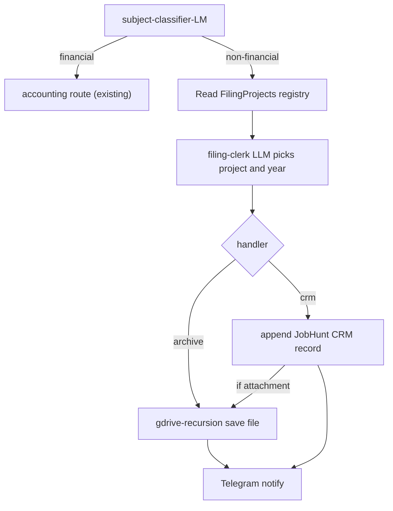

# Inbox organizer multi-project filing

```mermaid
flowchart TD
    C["subject-classifier-LM"] -->|financial| ACC["accounting route (existing)"]
    C -->|non-financial| REG["Read FilingProjects registry"]
    REG --> CLERK["filing-clerk LLM picks project and year"]
    CLERK --> H{"handler"}
    H -->|archive| FILE["gdrive-recursion save file"]
    H -->|crm| CRM["append JobHunt CRM record"]
    CRM -->|if attachment| FILE
    FILE --> N["Telegram notify"]
    CRM --> N
```
