# Smart Table Fill: Text-to-Structured-Data Extraction

Extract structured data from unstructured text into any Google Sheets table — zero schema configuration required.

  

---

## See It Work: Image Classification

> **6 images. 8 extraction fields. 4 mistakes.**
>
> Jensen Huang at a keynote, AI-generated cyberpunk art, a movie poster — can an LLM classify them all?

| Image | image_type | primary_subject | action_happening | person_count | source_hint |
|-------|------------|-----------------|------------------|--------------|-------------|
| Jensen Huang + robot | photograph | Jensen Huang with Disney robot | presenting robot at keynote | 1 | camera_photo |
| Neon cyberpunk | digital_art | computer monitor with neon lighting | displaying code with glitch effects | 0 | ai_generated |
| Movie poster | poster | three western characters | facing viewer in triptych | 3 | graphic_design |
| Fox character | illustration | anthropomorphic fox with device | holding glowing gadget | 0 | ai_generated |
| Logic puzzle | diagram | visual reasoning grids | presenting puzzle challenge | 0 | graphic_design |
| Spectacles | photograph | glasses and document | resting on surface | 0 | camera_photo |

<b>Where did the LLM get it wrong?</b>

1. **Neon cyberpunk** — "displaying code with glitch effects" is wrong; it's stylized text, not code
2. **Movie poster** — `source_hint` should be `ai_generated`, not `graphic_design`
3. **Spectacles** — `image_type` is not `photograph`; it's a graphic design piece
4. **Spectacles** — `source_hint` should be `ai_generated`, not `camera_photo`

<b>Schema used (copy to your sheet)</b>

Add to your `Description_hig7f6` sheet to replicate:

| ColumnName | Type | Description | Classes |
|------------|------|-------------|---------|
| image_type | class | Category of image content | photograph,screenshot,illustration,poster,diagram,digital_art,meme |
| primary_subject | str | Main subject or focus of the image | |
| action_happening | str | What activity or event is taking place | |
| key_objects | list | Notable items, objects, or features visible | |
| visual_complexity | class | How busy or dense the image is | minimal,moderate,busy |
| source_hint | class | Likely origin of the image | camera_photo,ai_generated,graphic_design,screen_capture,scan |
| person_count | int | Number of people visible in the image | |
| faces_visible | class | Whether human faces are clearly visible | none,partial,clear |

---

## Two Workflows

This project contains two complementary extraction workflows:

### smart-table-fill (main workflow)
**Text → Table**: Takes unstructured text, extracts structured data to columns.
- Input: Text string (email body, notes, etc.)
- Uses column batching for complex extractions (10+ fields)
- Cartesian product: each row × each batch = multiple LLM calls
- Best for: Complex schemas, many columns, existing text data

### smart-folder2table
**Folder → Table**: Takes a folder of images, extracts descriptions to table rows.
- Input: Google Drive folder of images
- Single LLM pass per file (no column batching)
- Handles schema creation, resumability, direct writes
- Best for: Batch image processing, visual inspection pipelines

### Which to use?

| Scenario | Workflow |
|----------|----------|
| Extract from email/text | smart-table-fill |
| Process folder of images | smart-folder2table |
| Many columns (10+) | smart-table-fill (has batching) |
| Simple extraction | Either works |

**Missing in smart-folder2table**: Column batching. All columns are extracted in a single LLM call, which may hit context limits with very wide schemas (15+ columns).

---

```mermaid
flowchart LR
    A[📥 Text Input] --> B{Extraction rules ready?}
    B -->|No| C[🤖 Create column instructions]
    C --> D
    B -->|Yes| D[🤖 Extract to columns]
    D --> E[📊 Write to Sheet]
    E ~~~ F[ ]
    classDef hidden fill:none,stroke:none,color:none
    class F hidden
```

## What it does

> **Auto-Schema Discovery** — Point it at any table. The workflow reads your column headers and builds the extraction schema dynamically. No manual field mapping.

**📝 Input** → Paste unstructured text (notes, emails, etc.)
**🔍 Discover** → Reads your table's column headers automatically
**🧠 Extract** → LLM structures data to match your schema
**📊 Store** → Updates the matching row in Google Sheets

## Rate Limit Handling

**Manual mode**: If you hit rate limits, increase `rate_limit_wait_seconds` in Config (try 60s, or more if needed). Restart - resumability skips already-processed files.

**Production mode**: When published and called via subworkflow trigger, the 007-error-handler handles it automatically - extracts retry timing from 429 errors and restarts with the correct delay.

## Who it's for

Anyone converting unstructured notes into structured data — sales teams logging calls, researchers organizing notes, anyone with a messy inbox.

> **Want a full CRM?** Combine with [04_inbox-attachment-organizer](../04_inbox-attachment-organizer) for auto-capture of contacts from incoming emails, organized folders, and AI-maintained profiles. See [email-crm-guide.md](docs/email-crm-guide.md).

## Quick Start

- [setup-guide.md](docs/setup-guide.md)
- [credentials-guide.md](../credentials-guide.md)
- [json-worksheet.md](docs/json-worksheet.md) — Introduction to JSON and structured data

## Video Tutorial

[**Watch on YouTube**](https://www.youtube.com/watch?v=OqA7aKWQ1q8) 

  

