# Smart Table Fill: Text-to-Structured-Data Extraction

Extract structured data from unstructured text into any Google Sheets table — zero schema configuration required.

> **Learning resource**: See [JSON Worksheet](docs/json-worksheet.md) for a printable introduction to JSON and structured data.

## Workflow Preview

  

📝 Any text input
🔍 Auto-discovers table schema
📊 Fills structured rows

---

## 🌟 Use Cases

**Out-of-the-box:** CRM entries from recurring client emails

**Alternatives:** Survey answers, contact form submissions, job applications, quote requests

```mermaid
flowchart LR
    A[📥 Text Input] --> B{Extraction rules ready?}
    B -->|No| C[🤖 Create column instructions]
    C --> D
    B -->|Yes| D[🤖 Extract to columns]
    D --> E[📊 Write to Sheet]
    E ~~~ F[ ]
    classDef hidden fill:none,stroke:none,color:none
    class F hidden
```

## What it does

**📝 Input** → Paste unstructured text (notes, emails, etc.)
**🔍 Discover** → Reads your table's column headers automatically
**🧠 Extract** → LLM structures data to match your schema
**📊 Store** → Updates the matching row in Google Sheets

## Who it's for

Anyone converting unstructured notes into structured data — sales teams logging calls, researchers organizing notes, anyone with a messy inbox.

> ### Auto-Schema Discovery
>
> Point it at any table — the workflow reads your column headers and builds the extraction schema dynamically. No manual field mapping needed.

## ⚡ Quick Start
- [setup-guide.md](docs/setup-guide.md)
- [parameters.md](docs/parameters.md) - LIST MODE parameters
- [credentials-guide.md](../credentials-guide.md)

> **Want a full CRM?** Combine with [03_inbox-attachment-organizer](../03_inbox-attachment-organizer) for auto-capture of contacts from incoming emails, organized folders, and AI-maintained profiles. See [email-crm-guide.md](docs/email-crm-guide.md).

## 📦 Requirements

- n8n ([cloud](https://n8n.cloud) or [self-hosted](https://youtu.be/kq5bmrjPPAY))
- Google Sheets
- Chat model (Groq — free)
