# Email-CRM Setup Guide

**Time:** 30 min | **Difficulty:** Intermediate | **Prerequisites:** Standalone setup complete

This guide walks you through setting up the full Email-CRM mode with automatic folder creation, email archiving, and AI-updated contact profiles.

---

## Architecture Overview

```mermaid
flowchart TB
    subgraph "📧 Email Pipeline"
        Gmail[Gmail Trigger] --> Classify[subject-classifier-LM]
    end

    subgraph "smart-table-fill"
        Classify --> Extract[🤖 LLM Extract]
        Extract --> Sheet[📊 Write to Sheet]
        Extract -.-> AppScript[Apps Script API]
    end

    subgraph "contact-memory-update"
        AppScript --> ContactFolder["📁 Contact Folder #40;GDrive#41;"]
        ContactFolder --> StoreEmail[📄 Store Email .md]
        ContactFolder --> UpdateProfile[🤖 Update Contact Profile]
    end
```



### Components

| Component | Purpose |
|-----------|---------|
| **smart-table-fill** | Core extraction workflow (both modes use this) |
| **contact-memory-update** | Subworkflow: email archive + AI profile update |
| **Apps Script** | Creates folders, writes to Sheet, returns row numbers |

### Why Apps Script?

The direct Google Sheets API can't return the row number after writing. Apps Script handles:
- Write data to Sheet → get row number
- Create contact folder if new
- Return folder IDs for downstream use

All in one atomic operation.

### Folder Structure

For each contact, the system creates:

```
📁 Contacts/
└── 📁 john-doe@example.com/
    ├── 📄 README.md          (AI-maintained profile)
    └── 📁 emails/
        ├── 📄 2026-01-07_meeting-request.md
        └── 📄 2026-01-08_follow-up.md
```

---

## Setup Steps

### 1. Import All Workflows

Import these into n8n:

- [smart-table-fill.n8n.json](../workflows/smart-table-fill.n8n.json) — Main workflow
- [contact-memory-update.json](../workflows/subworkflows/contact-memory-update.json) — Email archive + AI profile update
- [inbox-attachment-organizer.json](../../03_inbox-attachment-organizer/workflows/inbox-attachment-organizer.json) — Source for email pipeline nodes
- [subworkflow-lineage.json](../../03_inbox-attachment-organizer/workflows/subworkflows/subworkflow-lineage.json) — Email parsing subworkflow

**After importing:** Note each workflow's ID (visible in the URL) — you'll need these for Execute Workflow nodes.

### 2. Complete Standalone Setup First

Follow [setup-guide.md](setup-guide.md) to get the base workflow running.

### 3. Add Email Pipeline

Copy the email pipeline from [inbox-attachment-organizer.json](../../03_inbox-attachment-organizer/workflows/inbox-attachment-organizer.json) — all nodes from **Gmail Trigger** through **subject-classifier-LM**, plus their downstream lineage subworkflow call.

Two integration modes:

| Mode | How |
|------|-----|
| **All-in-one** | Paste nodes directly into your workflow |
| **Subworkflow** | Call smart-table-fill via Execute Workflow trigger |

### 4. Add Required Sheet Columns

Your Google Sheet needs these columns for CRM mode (add them now before Apps Script setup):

| Column | Type | Purpose |
|--------|------|---------|
| `folder_id` | string | Contact's Drive folder ID |
| `emails_folder_id` | string | Subfolder for email archives |

The Apps Script creates these folders automatically on first contact.

### 5. Setup Apps Script

Follow the detailed guide:

**➡️ [Apps Script Execution API Setup](apps-script-execution-api-setup.md)**

This covers:
- Creating the Apps Script project
- Deploying as API Executable
- Configuring OAuth scopes (3 needed: `spreadsheets` + `drive` + `script.scriptapp`)
- Testing the connection

### 6. Enable CRM Nodes

In `smart-table-fill`, find the four `[CRM]` nodes (greyed out):
1. `[CRM] Write via Apps Script`
2. `[CRM] IF: Apps Script Success?`
3. `[CRM] Prep Email Store Input`
4. `[CRM] Call contact-memory-update`

**Do:**
- Connect **Merge Outputs** → **[CRM] Write via Apps Script**
- Activate all four nodes (right-click → Activate)
- Update the subworkflow ID in `[CRM] Call contact-memory-update`

### 7. Test End-to-End

1. Trigger the workflow with a test email
2. Check: Data appears in Sheet
3. Check: Contact folder created in Drive
4. Check: Email archived as `.md` file
5. Check: `README.md` profile updated in contact folder

---

## Troubleshooting

| Issue | Solution |
|-------|----------|
| Apps Script returns error | Check OAuth scopes match in both Apps Script and n8n credential |
| Folder not created | Verify `folder_id` column exists in Sheet |
| Subworkflow not found | Update workflow ID in `[CRM] Call contact-memory-update` node |

---

## Video Tutorials

📺 *Coming soon*

---

## Related Docs

- [Apps Script Execution API Setup](apps-script-execution-api-setup.md) — Technical OAuth configuration
- [setup-guide.md](setup-guide.md) — Standalone mode (simpler)
- [credentials-guide.md](../credentials-guide.md) — Google OAuth setup
