# Email-CRM Setup Guide

**Time:** 30 min | **Difficulty:** Intermediate

This guide adds contact management to your existing inbox-attachment-organizer workflow. Incoming emails automatically create/update contacts in a Google Sheet, with organized Drive folders for each contact.

---

## What This Is

Email-CRM is an **extension** of [inbox-attachment-organizer](../../04_inbox-attachment-organizer), not a standalone workflow.

**inbox-attachment-organizer handles:** Gmail trigger, attachment extraction, AI classification

**This extension adds:** Contact lookup, CRM data extraction, folder creation, email archiving

## Architecture Overview

```mermaid
flowchart TB
    subgraph "📧 inbox-attachment-organizer"
        Gmail[Gmail Trigger] --> Classify[🤖 subject-classifier-LM]
        Classify --> RecordSearch[🔍 record-search]
    end

    subgraph "📊 smart-table-fill"
        RecordSearch --> Extract[🤖 LLM Extract]
        Extract --> AppScript[Apps Script API]
        AppScript --> Sheet[📝 Write to Sheet]
        AppScript --> Folders[📁 Create Contact Folders]
    end

    subgraph "💾 contact-memory-update"
        Folders --> StoreEmail[📄 Store Email .md]
        Folders --> UpdateProfile[🪪 Update Contact Profile]
    end
```



---

## Folder Structure

For each email, the system creates or updates:

```
📁 Entries/
└── 📁 john-doe@example.com/
    ├── 📄 README.md          (AI-maintained profile)
    └── 📁 emails/
        ├── 📄 2026-01-07_meeting-request.md
        └── 📄 2026-01-08_follow-up.md
```

---

## Phase 1: Prerequisites & Import Workflows

### 1.1 Check Email Pipeline

Before starting, confirm the email pipeline in [inbox-attachment-organizer](../../04_inbox-attachment-organizer) is working.

**Not set up yet?** You need the email pipeline from [inbox-attachment-organizer](../../04_inbox-attachment-organizer) — at minimum: Gmail Trigger through subject-classifier-LM and the CRM-lineage nodes. The other lineages (finance, appointments) are optional.

### 1.2 Import Subworkflows

Import these into n8n:

- [record-search.json](../workflows/subworkflows/record-search.json)
- [contact-memory-update.json](../workflows/subworkflows/contact-memory-update.json)
- [smart-table-fill.json](../workflows/smart-table-fill.n8n.json)

---

## Phase 2: Google Cloud Console

### 2.1 Find Your GCP Project Number

1. Go to [Google Cloud Console](https://console.cloud.google.com)
2. In the project dropdown (top left), find the project your n8n credentials use
3. Go to **Dashboard** and note the **Project Number** (numeric, e.g., `126925216054`)

> **Tip:** If unsure which project, check your n8n credential's Client ID - it contains the project info.

### 2.2 Enable Apps Script API

1. Go to [Apps Script API](https://console.cloud.google.com/apis/library/script.googleapis.com)
2. Click **Enable**

---

## Phase 3: Google Sheets Setup

Copy-paste these column headers (separated by tabs) into the first row of a Google Sheet named **"Entries"**:

```
folder_id	emails_folder_id	email	first_name	surname	more_emails	status	last_topic	last_being_contacted	last_contacted	association	groups	goal_contact_frequency	current_job	birthday	works_at	Interests_n_Expertise	address	phone	contact_created_at	contact_updated_at	notes
```

> **Note:** The default workflow batches 7 extract fields per LLM call. More columns = more LLM calls. Feel free to delete any columns you don't need, **except `email`, `folder_id`, and `emails_folder_id`** which are required.

On first workflow execution, n8n auto-generates the full schema. Example output:

| Column | Type | Purpose |
|--------|------|---------|
| `email` | string | Primary lookup key |
| `first_name` | string | For fuzzy matching |
| `surname` | string | For fuzzy matching |
| `more_emails` | string | Comma-separated additional emails |
| `folder_id` | string | Contact's Drive folder (auto-filled) |
| `emails_folder_id` | string | Email archive subfolder (auto-filled) |
| *(your custom columns)* | varies | LLM will extract data based on headers |

> **How it works:** The LLM reads your column headers and extracts relevant data from each email. Add columns like `company`, `phone`, `notes` - the schema is auto-generated.
>
> *Want more context on how schema auto-generation works? See the [smart-table-fill guide](setup-guide.md).*

### 3.1 Configure smart-table-fill

In the **smart-table-fill** workflow, open the **String Input** node and set:
- `spreadsheet_id`: Copy from your Sheet's URL (the long string between `/d/` and `/edit`)
- `data_sheet_name`: `Entries`

---

## Phase 4: Configure smart-table-fill for Mode B

### 4.1 Why Apps Script?

In standalone mode (Mode A), the workflow uses n8n's built-in **Google Sheets node** to write data. But this node can't trigger Apps Script features like creating contact folders in Drive.

For Email-CRM mode, we use the **Apps Script Execution API** instead — it writes to the Sheet AND creates folders in one atomic operation.

### 4.2 Switch to Mode B

Find the sticky note titled **"## Mode B: Email-CRM Setup"**. The 3 nodes in front of it need to be activated:

1. **Activate these nodes** (right-click → Activate):
   - `[CRM] Write via Apps Script`
   - `[CRM] Prep Email Store Input`
   - `[CRM] Call contact-memory-update`

2. **Deactivate the Mode A node** (right-click → Deactivate):
   - `Write_Excel`

3. **Connect the flow:** Wire **Merge Outputs** → **[CRM] Write via Apps Script**

4. Open **[CRM] Call contact-memory-update** node and select **contact-memory-update** from the dropdown

---

## Phase 5: Apps Script Setup

Now configure the Apps Script that the `[CRM] Write via Apps Script` node will call.

**Follow the detailed guide:**

**➡️ [Apps Script Execution API Setup](apps-script-execution-api-setup.md)**

This covers:
- Creating the script from your Sheet
- Adding code + OAuth scopes
- Linking to your GCP project
- Deploying as API Executable
- Creating the n8n OAuth credential

**When you return, you'll have:**
- Apps Script deployment URL (starts with `https://script.googleapis.com/v1/scripts/AKfycb...`)
- n8n OAuth credential with 3 scopes configured

**Then in smart-table-fill**, open **[CRM] Write via Apps Script** node:
- Paste your Apps Script URL
- Select your new OAuth credential

Click **Save** and **Publish**.

---

## Phase 6: Connect to inbox-attachment-organizer

Back in your **inbox-attachment-organizer** workflow.

### 6.1 Find the Contact Manager Branch

Look for this chain of 4 connected nodes:

```
ContactManager-lineage → Call 'record-search' → Prepare Contact Input → Call 'smart-table-fill'
```

### 6.2 Select the Subworkflows

Open each Execute Workflow node and select the correct workflow from the dropdown:

| Node | Select from dropdown |
|------|----------------------|
| `Call 'record-search'` | **record-search** |
| `Call 'smart-table-fill'` | **smart-table-fill** |

### 6.3 Enable the Branch

- Select the **ContactManager-lineage** nodes and press your key `D` to undo the deactivation.

### 6.4 Save

Click **Save** and **Publish**.

---

## Phase 7: Test End-to-End

1. Send a test email to your monitored inbox
2. Wait for the workflow to process (~1 min)

**Verify:**
- [ ] Email classified by subject-classifier-LM
- [ ] Contact row created/updated in Entries sheet
- [ ] `folder_id` and `emails_folder_id` columns populated
- [ ] Contact folder created in Drive with `README.md`
- [ ] Email archived as `.md` file in `emails/` subfolder

---

## Troubleshooting

| Issue | Solution |
|-------|----------|
| Apps Script returns error | Check OAuth scopes match in both Apps Script and n8n credential |
| Folder not created | Verify `folder_id` column exists in Sheet |
| Subworkflow not found | Open the Execute Workflow node and select the correct workflow from the dropdown |
| Contact not matched | Check `email` column has correct value; try `more_emails` for aliases |

---

## Related Docs

- [Apps Script Execution API Setup](apps-script-execution-api-setup.md) — OAuth configuration details
- [inbox-attachment-organizer](../../04_inbox-attachment-organizer) — Prerequisite workflow
- [Standalone setup](setup-guide.md) — Mode A (simpler, no email integration)
