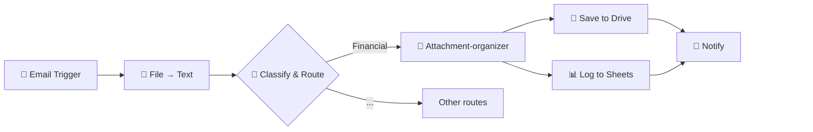

# AI Email Monitoring (I): Auto-File Email Attachments

Automatically process email attachments (images, PDFs, documents), understand content through AI, and file to structured Google Drive folders.

## Workflow Preview

  

📧 Email attachments (images, PDFs, docs)
🧠 AI classification & extraction
📁 Auto-file to Google Drive folders

---

> ### Single Authentication Advantage
>
> **Authentication is automation's biggest bottleneck.** This workflow operates with **ONE Google OAuth connection** (Gmail + Drive + Sheets) — avoiding the 3-5 platform authentications typical workflows require.

## 🌟 Use Cases

**Out-of-the-box:** Financial documents (invoices, receipts)

**Alternatives:** School materials, work reports, client contracts

## What it does

**📧 Trigger** → Gmail receives email with attachment
**📎 Extract** → Downloads and converts attachments to text
**🧠 Classify** → AI determines document type (invoice, receipt, etc.)
**💰 Parse** → Extracts fields from financial documents
**📁 File** → Uploads to `Accounting/2025/05_May/Expense/`
**📝 Log** → Records to Google Sheets

## Who it's for

Anyone drowning in email attachments — accountants, small business owners, freelancers who receive invoices and receipts via email.

## 📋 Features

 ✅ Reads images via AI vision (Gemini Flash OCR) and processes PDFs and documents

 ✅ Logs to Google Sheets

 ✅ Extensible via structured output schemas

 ✅ Processes existing emails in mailbox (not just new incoming emails)

---

## ⚡ Quick Start
- [setup-guide.md](docs/setup-guide.md)
- [credentials-guide.md](../credentials-guide.md)

## 📦 Requirements

- n8n ([cloud](https://n8n.cloud) or [self-hosted](https://youtu.be/kq5bmrjPPAY))
- Google (Gmail, Drive, Sheets) — single login
- Chat model (Groq, Gemini — both free)
- Telegram bot (optional)