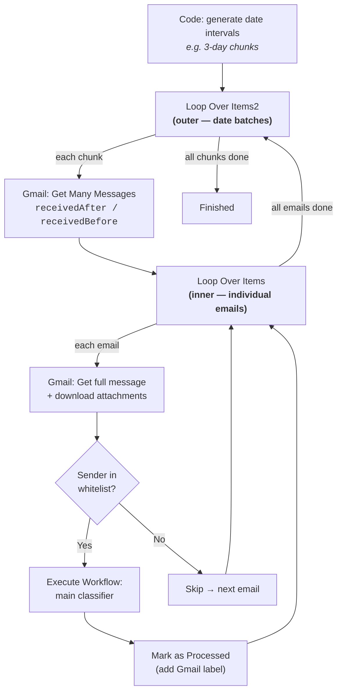

# Gmail Systematic Processor

Batch-process existing inbox emails by date range. Calls the main inbox-attachment-organizer workflow per email.

## Why This Exists

The Gmail Trigger node only catches **new** emails arriving after activation. To process historical or backlogged emails, you need this standalone batch processor. Run it manually whenever you want to reprocess a time window of past emails.

---

## The Double-Loop Pattern

This is the core design of this workflow — and the reason it exists as a separate subworkflow.

### The problem

Gmail's "Get Many Messages" node returns up to 500 messages per call. For large inboxes or wide date ranges, a single fetch either hits that limit (silently dropping messages) or times out. n8n has no built-in way to paginate Gmail by date.

### The solution: two nested loops

A **Code node** generates small date intervals (e.g. 3-day chunks), then two `Split In Batches` nodes process them:

```
Outer loop (Loop Over Items2)         Inner loop (Loop Over Items)
 Feeds one date chunk at a time        Feeds one email at a time
 ┌─────────────────────────┐           ┌──────────────────────────┐
 │  {start: Jan 1, end: Jan 3}  │──→  Gmail fetches  ──→│  Process email 1 of N        │
 │  {start: Jan 4, end: Jan 6}  │     messages in       │  Process email 2 of N        │
 │  {start: Jan 7, end: Jan 9}  │     this chunk        │  ...                         │
 └─────────────────────────┘                             │  Done → back to outer loop   │
                                                         └──────────────────────────────┘
```



### Why not a single loop?

n8n's `Split In Batches` node only operates on items **already loaded in memory**. It cannot tell Gmail "give me the next page." So the outer loop controls what Gmail fetches (by feeding it date windows), and the inner loop iterates over whatever Gmail returned. This is the only way to do date-batched pagination in n8n without a custom node.

---

## Configuration

Everything is in the **Set Label Variable** node (first node after the trigger):

| Field | Purpose | Default |
|-------|---------|---------|
| `processLabel` | Gmail label name used to mark processed emails | `GdriveFiled` |
| `email_whitelist` | Array of sender addresses — only these get analyzed, rest are skipped | `["payments-noreply@google.com", ...]` |
| `batch_mode` | `date` = scan by date chunks, `size` = fetch newest N emails | `date` |
| `email_limit` | Max emails to fetch per date chunk. `0` = dry run (no emails processed) | `500` |
| `lookback_days` | How far back to start scanning (date mode only) | `1` |
| `interval_days` | Size of each date chunk in days (date mode only) | `3` |

### Batch Modes

**Date mode** (`batch_mode = date`) — The default. Generates chunked date intervals going back `lookback_days` from today, with each chunk spanning `interval_days`. This flattens load peaks by fetching emails in small windows. Best for daily scheduled runs.

**Size mode** (`batch_mode = size`) — Fetches up to `email_limit` of the newest emails regardless of date. Uses a single wide date range (2000 to tomorrow). Best for one-off reprocessing or catching emails outside the lookback window.

**Dry run** (`email_limit = 0`) — The Code node returns an empty array, so no Gmail calls are made. The setup branch (label creation, label lookup) still runs. Useful for verifying label logic without touching emails.

---

## Flow Walkthrough

### Setup branch (runs once)

1. **Set Label Variable** — loads config (label name, whitelist, batch settings)
2. **Create a label** — creates the Gmail label (no-ops if it exists, `onError: continueRegularOutput`)
3. **Get many labels** → **Filter** — fetches all labels, finds the one matching `processLabel` to get its ID

### Processing branch

4. **Set Date-Range to process** — Code node reads config from Set Label Variable and generates date intervals (or returns empty for dry run)
5. **Loop Over Items2** (outer) — feeds one date chunk per iteration
6. **Get many messages** — fetches emails in that date window (capped by `email_limit`)
7. **Loop Over Items** (inner) — feeds one email per iteration
8. **Gmail** — fetches full message with attachments
9. **Edit Fields** — extracts `id` and `from-address` (with fallback chain)
10. **If** (whitelist check) — sender in whitelist?
    - **Yes** → **Analyze file** (calls main workflow) → **Mark as Processed** (adds label) → next email
    - **No** → skip → next email
11. When inner loop finishes → back to outer loop for next date chunk

---

## Testing Tips

n8n is a visual, feedback-driven tool. Test incrementally:

1. **Start with a dry run**: Set `email_limit` to `0` and execute. Verify the setup branch works (label created, label ID found) without fetching any emails.
2. **Small test next**: Set `email_limit` to `2` and `lookback_days` to `1`. This fetches at most 2 emails from yesterday — fast and safe.
3. **Try size mode**: Set `batch_mode` to `size` and `email_limit` to `50` to test fetching by count instead of date.
4. **Run setup branch in isolation**: Click on `Set Label Variable` and execute just that branch to verify label creation works.
5. **Check loop output**: After running, click on each `Split In Batches` node to inspect what items it received and how many iterations it ran.
6. **Disable Analyze file first**: If you just want to verify the fetch/filter logic without triggering the full classifier pipeline, disable the `Analyze file` node temporarily.
7. **Watch the If node**: Click on it after execution to see which emails went to "true" (whitelisted) vs "false" (skipped). This confirms your whitelist is correct.

Full testing guide: `docs/testing-gmail-processor.md`
