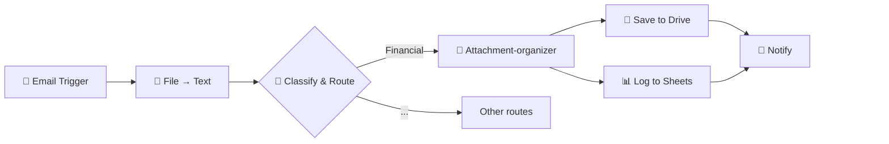

# AI Email Monitoring (I): Auto-File Email Attachments

Automatically process email attachments (images, PDFs, documents), understand content through AI, and file to structured Google Drive folders.

## Workflow Preview

  

📧 Email attachments (images, PDFs, docs)
🧠 AI classification & extraction
📁 Auto-file to Google Drive folders

---

> ### Single Authentication Advantage
>
> **Authentication is automation's biggest bottleneck.** This workflow operates with **ONE Google OAuth connection** (Gmail + Drive + Sheets) — avoiding the 3-5 platform authentications typical workflows require.

## 🌟 Use Cases

**Out-of-the-box:** Financial documents (invoices, receipts)

**Alternatives:** School materials, work reports, client contracts

## What it does

**📧 Trigger** → Gmail receives email with attachment
**📎 Extract** → Downloads and converts attachments to text
**🧠 Classify** → AI determines document type (invoice, receipt, etc.)
**💰 Parse** → Extracts fields from financial documents
**📁 File** → Uploads to `Accounting/2025/05_May/Expense/`
**📝 Log** → Records to Google Sheets

## Who it's for

Anyone drowning in email attachments — accountants, small business owners, freelancers who receive invoices and receipts via email.

## 📋 Features

 ✅ Reads images via AI vision (Gemini Flash OCR) and processes PDFs and documents

 ✅ Logs to Google Sheets

 ✅ Extensible via structured output schemas

 ✅ Processes existing emails in mailbox (not just new incoming emails)

---

## ❓ FAQ

### 4 attachments, but only 2 ledger rows?

Rows don't count files. **One row = one invoice**, keyed by `invoice_number` — an invoice and its
receipt describe one transaction, so they share a row.

| What arrived | Rows |
|---|---|
| Invoice + receipt, same order | **1** |
| Two separate orders | **2** |
| One order billed as two invoices | **2** |
| One invoice split across two files | **1** |

That "what one row represents" rule is called the table's *grain* — a data-modelling term for
what an accountant calls "one journal entry per transaction".

### A row changed after it was written

`date_paid`, `payment_reference`, `payment_method` and `invoice_status` fill in when the receipt
arrives, possibly days later.

### `AUTOKEY::` in the invoice_number column?

The document carried no invoice number, so we generated a key. **Contains `::` = ours, never a
supplier's.**

## ⚡ Quick Start
- [setup-guide.md](docs/setup-guide.md)
- [credentials-guide.md](../credentials-guide.md)

## 📦 Requirements

- n8n ([cloud](https://n8n.cloud) or [self-hosted](https://youtu.be/kq5bmrjPPAY))
- Google (Gmail, Drive, Sheets) — single login
- Chat model (Groq, Gemini — both free)
- Telegram bot (optional)