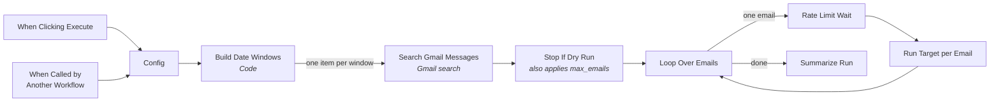

# Gmail Batch Processor (`gmail-processor-datesize`)

Finds emails with a **Gmail search** and runs a **target workflow** once per email. It's generic on
purpose: build anything that has to act on a *set* of existing emails on top of it, instead of
writing another fetch-and-loop.

Out of the box it catches up `inbox-attachment-organizer`: its default search finds the emails
the organizer missed (see [below](#catching-up-the-organizer)).

## Why this exists

The Gmail Trigger only sees emails that arrive **while the workflow is active**. Anything older,
or anything that arrived during an outage, is invisible to it. This workflow is the way to reach
those emails.

## What it does, and what it deliberately doesn't



It **selects** emails and **hands them over**. It never decides what an email means, and never
labels, archives, whitelists or filters. All of that is the target's job, so each rule is written
down in exactly one place.

The target receives the message item as-is (`id`, `threadId`, `labels`) and fetches the full
email itself. `inbox-attachment-organizer` does this already, starting at `Set File ID`.

## Configuration

Everything is in **Config**. A manual run uses the defaults; a calling workflow overrides any
field it passes (`$json.field ?? default`).

| Field | What it does | Default |
|---|---|---|
| `query` | Gmail search, same syntax as the search bar | the emails the organizer missed ([below](#catching-up-the-organizer)) |
| `target_workflow_id` | ID of the workflow run once per email (the part of its URL after `/workflow/`) | the author's organizer: replace it with yours |
| `max_emails` | max emails **per run**. `0` = no cap. The rest is reported as `left_for_next_run`; run again to continue | `200` |
| `rate_limit_wait_seconds` | pause between two emails, for targets that call a rate-limited LLM. Keep it under 60: a longer wait makes n8n park the run in its database | `0` |
| `batch_mode` | `date` = walk back in windows, `size` = newest N over all time | `date` |
| `lookback_days` | how far back to start (date mode). Older emails are not looked at: raise it to reach them | `365` |
| `interval_days` | size of each window in days (date mode) | `30` |
| `email_limit` | max emails **per window**. `0` = dry run: lists the matches in **Search Gmail Messages** (up to 500 per window) and runs no target | `500` |

## Design notes

**Windows without loops.** `Build Date Windows` emits one item per window, and `Search Gmail Messages` runs once
per input item, so the mailbox is fetched window by window without a loop. A loop around the
search would carry a trap: a window with zero emails stops the branch, the loop never resumes, and
the run ends early looking like a success.

**Sequential, failure-tolerant hand-off.** `Loop Over Emails` hands one email at a time to
`Run Target per Email`, which waits for the sub-run. It is set to continue on error, so one bad
email becomes an `error` item instead of aborting the batch, and to always output, so a target
that returns nothing does not end the loop early. **Summarize Run** returns
`{query, found, processed, failed, left_for_next_run, errors}` to the caller.

**Pause and cap.** `Rate Limit Wait` waits `rate_limit_wait_seconds` before every email except
the first. The cap needs no node of its own: `Stop If Dry Run` stops everything when
`email_limit` is `0`, and otherwise lets only the first `max_emails` emails through.

**No attachment download here.** The walker only lists messages. The target fetches what it needs,
so a run over hundreds of emails holds a few hundred ids in memory, not their attachments.

## Catching up the organizer

The Config defaults make one click a catch-up: every email the organizer missed while it was down,
broken, or not yet switched on goes through it. Those emails are one Gmail search:

```
{-label:n8n label:inProgress} -label:gdr -category:promotions -in:draft -{subject:"n8n workflow failure alert" subject:"n8n infra/runner failure"}
```

| Part | Why |
|---|---|
| `-label:n8n` | never seen: arrived while the organizer wasn't running |
| `label:inProgress` | started, then died: the organizer sets this label at the start of a run and removes it at the end |
| `-label:gdr` | already filed to Drive. `save doc to folder` is a plain upload, so a re-run would store the file twice |
| `-category:promotions` | the live trigger drops promotions (`Stop promotions`) before the organizer, and the called path skips that node, so the query does it instead |
| `-in:draft` | a draft is not mail yet. The live trigger never sees one, and Gmail gives it a new id on every edit |
| `-{subject:"n8n workflow failure alert" ...}` | the error handler's own alert emails. The live trigger ignores them too (`Gmail Trigger` → Search). If the organizer processed them, a failing run would answer its own alert, once a minute |

**How to run it**

1. Paste the search into the Gmail search bar to see what will be processed.
2. Click **Execute workflow**. One click processes up to 200 emails, about 20 seconds each.
3. The output of **Summarize Run** shows `left_for_next_run`. Click again until it is `0`.

Running it twice is safe: every email the organizer finishes is labelled `n8n`, so the next run
only picks up what is still missing. A failed email keeps `inProgress` and is picked up again.
Every filed invoice sends a Telegram report, so a large run is noisy.

**Want a way back first?** Run [`gmail-backup`](gmail-backup.md) before the first click. It is a
separate workflow and optional: the organizer never deletes or edits an email, it only sets
labels, and the backup lets you reset those.

**A large backlog needs a paid LLM tier.** One email costs about 5,000 tokens on average
(classifier, one extraction per attachment, contact branch). A free tier is enough for new mail,
not for a backlog: a typical one allows 8,000 tokens per minute and 200,000 per day, which is
about 40 emails per day, new mail included. Past that every email fails on the limit and keeps
its `inProgress` label until the next run. For a few hundred emails, switch the model nodes of
the organizer and its sub-workflows to a paid tier for the catch-up: 200 emails are about one
million tokens, well under one US dollar on a small, fast model. Emails with images also need a
vision-capable LLM without a tight per-minute limit: every inline logo is one request.

**On a free LLM tier** set `max_emails: 25` and `rate_limit_wait_seconds: 45`, or most emails fail
on the tokens-per-minute limit.

**Self-hosted n8n in queue mode** keeps its files in the database. There the attachment files of
every processed email stay behind, about 2 MB per email with attachments. On a small database,
keep `max_emails` low, or run the [database guard](../../14_db-janitor/workflows/mainflow.md),
which deletes those files an hour later.

## Testing

See [testing-gmail-processor.md](testing-gmail-processor.md).
