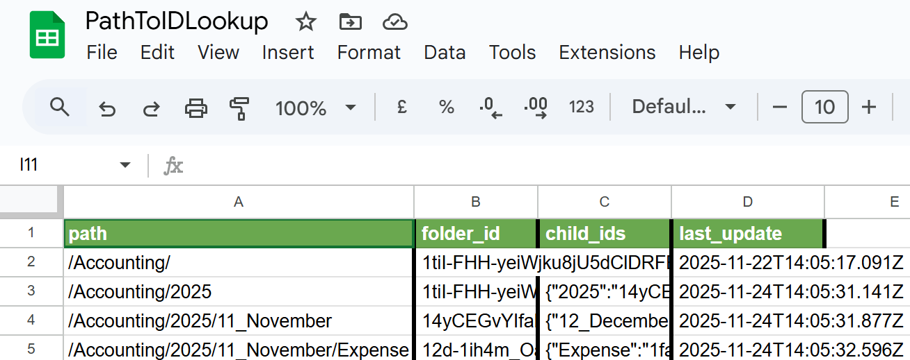

## ⚡ Quick Start

**Time:** 60 minutes | **Difficulty:** Easy | **Cost:** free for new mail on a free LLM tier; catching up a backlog needs a paid tier

> ### ⚡ Setup Advantage
>
> Gmail, Drive and Sheets run on **one Google OAuth connection**. Besides that you need an LLM API key and, for the reports, a Telegram bot.
>
> Standard n8n nodes only: it runs on n8n Cloud and self-hosted alike.

### 1. Import Workflows

In n8n, create an empty workflow per file and paste the file's content onto the canvas:

1. [inbox-attachment-organizer.json](../workflows/inbox-attachment-organizer.json): the main workflow
2. [any-file2json-converter.json](../../03_any-file2json-converter/workflows/any-file2json-converter.json): converts attachments to text
3. [gdrive-recursion.json](../../shared/gdrive-recursion.json): finds or creates the Drive folder for a path

Only if you want to process mail that is already in the mailbox (step 8):

4. [gmail-processor-datesize.json](../workflows/subworkflows/gmail-processor-datesize.json): sends the emails the organizer missed through it
5. [gmail-backup.json](../workflows/gmail-backup.json): optional, backs up the mailbox first so the run can be undone

**Publish** workflows 2 to 5 after importing them: a workflow can only be called once it is published. Leave the organizer unpublished until step 7, because publishing it starts the Gmail trigger. If Publish does not work, see [troubleshooting.md](../../troubleshooting.md).

The organizer also has a contact branch (`Call 'record-search'` → `Prepare Contact Input` → `Call 'smart-CRM-fill'`) that keeps a contact sheet up to date. It needs the workflows and the sheet of project 02: see [Contact branch](#contact-branch-optional). **To run without it, disable those three nodes.**

### 2. Set Up Credentials

Follow [credentials-guide.md](../../credentials-guide.md):

- **Google OAuth** (Gmail, Drive, Sheets): select it in every Gmail, Drive and Sheets node
- **LLM API key**: select it in the model nodes `Any LM` and `any LM1`, and in the model nodes of the converter (one of them must be vision-capable)
- **Telegram bot**: select it in `Telegram & done` and enter your chat ID. To run without Telegram, disable that node

### 3. Create Gmail Labels

The organizer uses three Gmail labels:

- `inProgress`: set when a run starts, removed when it ends. An email that keeps it is a failed run
- `n8n`: the run finished
- `gdr`: an attachment was saved to Google Drive

1. In the Gmail sidebar, click **+ Create new label** three times: `inProgress`, `n8n`, `gdr`
2. In **Tag n8n**, select `n8n` in the label list. In **Tag gdr**, select `gdr`
3. `inProgress` is entered as an ID. To read it, add a temporary Gmail node (Resource **Label**, Operation **Get Many**), execute it, copy the `id` of `inProgress` (it starts with `Label_`) and delete the node
4. In **Set File ID**, paste that ID into `label_ID`. `Tag inProgress` and `Remove inProgress` read it from there

### 4. Create the Billing_Ledger Google Sheet

> **What is a Billing Ledger?** One list of all invoices, both the ones you pay (Expense) and the ones you send (Revenue), with their payment data.

Create a Google Sheet named **Billing_Ledger** in your Drive accounting folder (for example `/Accounting`). Copy the line below into cell A1; the tabs spread it over 16 columns:

```
accounting_category	invoice_status	invoice_number	attachment_count	email_id	counterparty_name	invoice_date	subtotal_amount	currency_code	payment_method	due_date_or_payment_terms	payment_reference	date_paid	tax_amount	discount_amount	purchase_order_number
```

Then select this sheet in the node **insert doc record**.

| Field | Filled by | Description |
|-------|-----------|-------------|
| `accounting_category` | LLM | `Revenue` or `Expense` |
| `invoice_status` | you | Your own status (paid, pending, overdue). The workflow never writes it |
| `invoice_number` | LLM | Invoice or receipt number. One row per invoice number |
| `attachment_count` | workflow | Number of attachments in the email |
| `email_id` | workflow | Email address of the other party |
| `counterparty_name` | LLM | The other party: supplier (Expense) or customer (Revenue) |
| `invoice_date` | LLM | Document date (YYYY-MM-DD) |
| `subtotal_amount` | LLM | Total amount due |
| `currency_code` | LLM | CHF, EUR, USD, ... |
| `payment_method` | LLM | TWINT, bank transfer, credit card, ... |
| `due_date_or_payment_terms` | LLM | Payment deadline or terms ("net 30", "upon receipt") |
| `payment_reference` | LLM | Transaction or payment ID |
| `date_paid` | LLM | Date of payment (YYYY-MM-DD) |
| `tax_amount` | LLM | VAT or tax amount |
| `discount_amount` | LLM | Discount, if any |
| `purchase_order_number` | LLM | PO number, if referenced |

### 5. Create the PathToIDLookup Google Sheet

n8n's Drive nodes need folder IDs, not paths like `/Accounting/2026/05_May/`. This sheet maps one to the other and fills itself: `gdrive-recursion` adds a row for every folder it finds or creates.

Create a Google Sheet named **PathToIDLookup** at the **top level of My Drive** and copy this line into cell A1:

```
path	folder_id	child_ids	last_update
```

Then, in the workflow `gdrive-recursion`, select this sheet in the nodes **Cache OR Query** and **Cache New Path**.



*Example: path `/Accounting/2026/05_May/Expense` maps to folder_id `1abc...xyz`*

### 6. Point the Organizer at Your Own Resources

| Node | Field | Set to |
|---|---|---|
| **Set File ID** | `owner_name`, `company_name` | your name and company (the classifier uses them to tell sender from recipient) |
| **Call 'gdrive-recursion'** | `root_folder_id` | the ID of your `/Accounting` folder: the last part of its URL, `https://drive.google.com/drive/folders/<ID>` |
| **Call 'gdrive-recursion'**, **Create Attachment Profile** | workflow | your imported `gdrive-recursion` and `any-file2json-converter` |
| `gdrive-recursion` → **Recurse (Call Self)** | workflow | `gdrive-recursion` itself |
| Workflow settings (⋯ → Settings) | Error workflow | your error workflow, if you have one ([error handler](../../10_error-handler/workflows/010-error-handler.json)) |

The folders are created on demand in this structure:

```
/Accounting/
  └─ 2026/
      └─ 05_May/
          ├─ Revenue/
          └─ Expense/
```

To use another root folder name, change `root_path` in **Call 'gdrive-recursion'** and the `folder-path` field in **input folder lookup**. A ready-made folder tree to upload is in [templates/drive-folder-structure/](../templates/drive-folder-structure/); it is optional.

### 7. Test and Activate

1. **Publish** the organizer. The Gmail trigger now checks for new mail every minute
2. Send yourself an email with an invoice attached
3. Within about two minutes the email carries `n8n` and `gdr`, the file is in `/Accounting/<year>/<month>/Expense` or `Revenue`, and Billing_Ledger has a row

An email that keeps `inProgress` failed: open the organizer's **Executions** tab.

### 8. Process Existing Emails (optional)

The Gmail trigger only sees new mail. For everything already in the mailbox:

1. **Optional: back up first.** In `gmail-backup`, click ▶ on the trigger **When Clicking Execute** and wait for `verified: true`. It lets you undo the label changes later: [gmail-backup.md](gmail-backup.md)
2. In `gmail-processor-datesize`, set `target_workflow_id` in **Config** to the ID of your organizer (the part of its URL after `/workflow/`)
3. Click **Execute workflow**. It processes up to 200 of the emails the organizer missed
4. The output of **Summarize Run** shows `left_for_next_run`. Click again until it is `0`

More than about 40 emails need a paid LLM tier: [the numbers](gmail-processor-datesize.md#catching-up-the-organizer).

### 9. Clear Out the Inbox (optional)

When the catch-up is done, the filed emails carry `n8n` and `gdr`. Two steps keep the inbox clean from here on:

1. **Existing mail, once, by hand.** Paste this into the Gmail search bar, select all, click **Archive**:
   ```
   label:n8n label:gdr in:inbox
   ```
   The emails stay under All Mail with their labels; the documents are already in Drive and in the ledger.
2. **New mail, automatically.** In the organizer, set `archive_when_filed` to `true` in **Set File ID**. From then on an email leaves the inbox as soon as its document is filed. Emails without a filed document stay in the inbox, and so does anything that failed.

## 🌟 Use Cases

**Out of the box:** financial documents (invoices, receipts)

**Extend to:**
- Legal contracts (Contracts/ClientName/YYYY/)
- HR documents (Personnel/EmployeeName/)
- Project files (Projects/ProjectName/Deliverables/)

---

## Contact branch (optional)

The nodes `Call 'record-search'` → `Prepare Contact Input` → `Call 'smart-CRM-fill'` create or update one row per contact in a Google Sheet. They call two workflows of project 02:

- [record-search.json](../../02_smart-table-fill/workflows/subworkflows/record-search.json)
- [smart-table-fill.n8n.json](../../02_smart-table-fill/workflows/smart-table-fill.n8n.json), shown on the canvas as `smart-CRM-fill`. It calls [contact-memory-update.json](../../02_smart-table-fill/workflows/subworkflows/contact-memory-update.json)

Setup: [Email-CRM guide](../../02_smart-table-fill/docs/email-crm-guide.md) and, for the contact folders, the [Apps Script Execution API guide](../../02_smart-table-fill/docs/apps-script-execution-api-setup.md).
