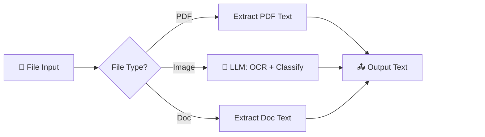
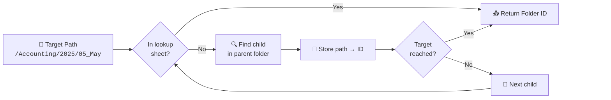
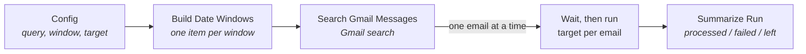

# Workflows

## Main
- `inbox-attachment-organizer.json` — Main workflow (37 nodes)

## Subworkflows

---

### [any-file2json-converter](../../03_any-file2json-converter/workflows/any-file2json-converter.json)
Converts PDFs/images/docs to text

```mermaid
flowchart LR
    A[📄 File Input] --> B{File Type?}
    B -->|PDF| C[Extract PDF Text]
    B -->|Image| D[🤖 LLM: OCR + Classify]
    B -->|Doc| E[Extract Doc Text]
    C --> F[📤 Output Text]
    D --> F
    E --> F
    F ~~~ G[ ]
    classDef hidden fill:none,stroke:none,color:none
    class G hidden
```

---

### [gdrive-recursion](../../shared/gdrive-recursion.json)
Finds folder ID for a given path (e.g. `/Accounting/2025/05_May`)

```mermaid
flowchart LR
    A[📂 Target Path<br/><code>/Accounting/2025/05_May</code>] --> B{In lookup<br/>sheet?}
    B -->|Yes| C[📤 Return Folder ID]
    B -->|No| D[🔍 Find child<br/>in parent folder]
    D --> E[💾 Store path → ID]
    E --> F{Target<br/>reached?}
    F -->|No| G[🔄 Next child]
    G --> B
    F -->|Yes| C
    C ~~~ H[ ]
    classDef hidden fill:none,stroke:none,color:none
    class H hidden
```

1. First: Check `PathToIDLookup` sheet for cached path→ID
2. If not cached: Find child folder inside parent
3. Then: Save the new path→ID to the lookup sheet
4. Repeat: for each folder segment until target reached

---

## For existing mail

The Gmail trigger only sees new mail. Two independent workflows deal with what is already in the
mailbox. Both are started by hand; neither calls the other.

### [gmail-processor-datesize](subworkflows/gmail-processor-datesize.json)
A **Gmail search** selects emails, and a **target workflow** runs once per email. With its default
Config it catches up the organizer: one click sends up to 200 missed emails through it. It has no
rules of its own (no whitelist, no labels), so it can't drift from the workflow it calls.
Details: [`docs/gmail-processor-datesize.md`](../docs/gmail-processor-datesize.md).

```mermaid
flowchart LR
    A["Config<br/><i>query, window, target</i>"] --> B["Build Date Windows<br/><i>one item per window</i>"]
    B --> C["Search Gmail Messages<br/><i>Gmail search</i>"]
    C -->|one email at a time| D["Wait, then run<br/>target per email"]
    D --> E["Summarize Run<br/><i>processed / failed / left</i>"]
```

### [gmail-backup](gmail-backup.json)
Saves every email as an `.eml` file and all labels as a snapshot in Drive, verifies the copy, and
restores from it through a form. Optional: run it before the catch-up if you want a way back.
Details: [`docs/gmail-backup.md`](../docs/gmail-backup.md).
