# Workflows

## Main
- `inbox-attachment-organizer.json` — Main workflow (33 nodes)

## Subworkflows

---

### [any-file2json-converter](subworkflows/any-file2json-converter.json)
Converts PDFs/images/docs to text

```mermaid
flowchart LR
    A[📄 File Input] --> B{File Type?}
    B -->|PDF| C[Extract PDF Text]
    B -->|Image| D[🤖 LLM: OCR + Classify]
    B -->|Doc| E[Extract Doc Text]
    C --> F[📤 Output Text]
    D --> F
    E --> F
    F ~~~ G[ ]
    classDef hidden fill:none,stroke:none,color:none
    class G hidden
```

---

### [gdrive-recursion](subworkflows/gdrive-recursion.json)
Finds folder ID for a given path (e.g. `/Accounting/2025/05_May`)

```mermaid
flowchart LR
    A[📂 Target Path<br/><code>/Accounting/2025/05_May</code>] --> B{In lookup<br/>sheet?}
    B -->|Yes| C[📤 Return Folder ID]
    B -->|No| D[🔍 Find child<br/>in parent folder]
    D --> E[💾 Store path → ID]
    E --> F{Target<br/>reached?}
    F -->|No| G[🔄 Next child]
    G --> B
    F -->|Yes| C
    C ~~~ H[ ]
    classDef hidden fill:none,stroke:none,color:none
    class H hidden
```

1. First: Check `PathToIDLookup` sheet for cached path→ID
2. If not cached: Find child folder inside parent
3. Then: Save the new path→ID to the lookup sheet
4. Repeat: for each folder segment until target reached

---

### [gmail-processor-datesize](subworkflows/gmail-processor-datesize.json)
Batch processes existing inbox emails (calls main workflow per email). Uses a **double-loop** pattern: outer loop feeds date chunks to Gmail, inner loop processes individual messages.

1. Gmail Trigger only catches new emails — this handles historical/backlog
2. Outer loop splits date range into small chunks (avoids 500-message API limit)
3. Inner loop processes each email: fetch full message, check whitelist, analyze or skip
4. See [`docs/gmail-processor-datesize.md`](../docs/gmail-processor-datesize.md) for full details
