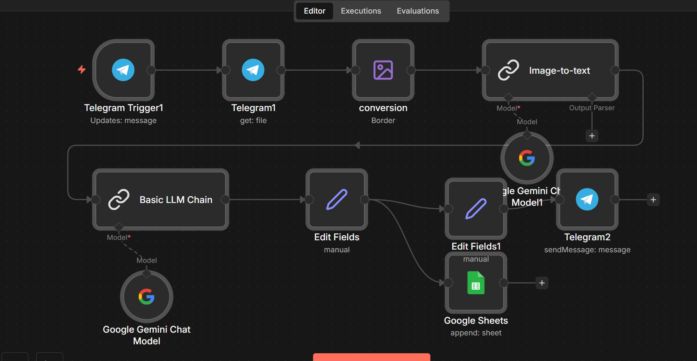

# Telegram Invoice OCR to Excel

  

Send invoice photos via Telegram, get structured data in Google Sheets automatically.

## What it does

**📸 Receive** → Telegram bot accepts invoice photos
**🔍 OCR** → Gemini extracts text from the image
**🧠 Parse** → LLM converts text to structured invoice data
**📊 Store** → Appends extracted fields to Google Sheets
**💬 Confirm** → Sends summary back via Telegram

## ⚡ Quick Start

1. Copy the JSON workflow into n8n (`Ctrl+V` on canvas)
2. Configure Telegram bot credentials
3. Configure Google Gemini API
4. Configure Google Sheets connection
5. Update the target spreadsheet ID

## 📦 Requirements

- n8n ([cloud](https://n8n.cloud) or [self-hosted](https://youtu.be/kq5bmrjPPAY))
- Telegram Bot API
- Google Gemini API
- Google Sheets (with service account)
