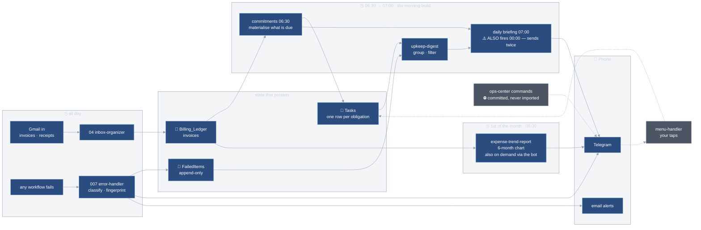
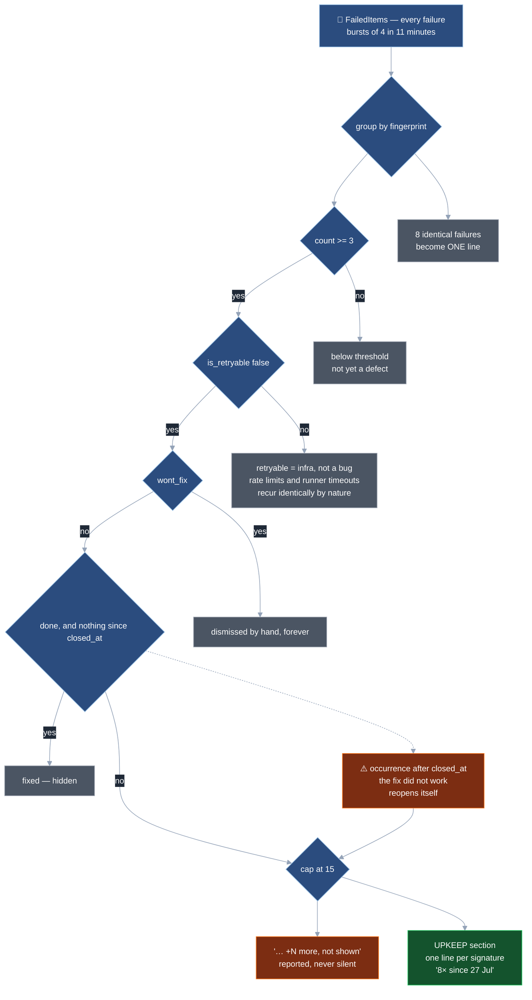
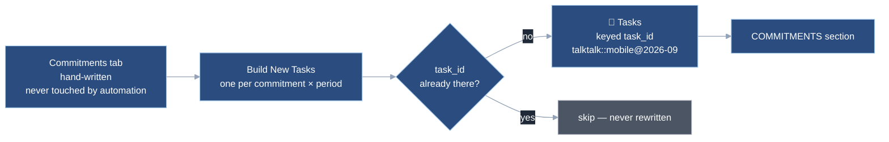

# Event flow — what reaches you, and what is filtered out on the way

Where events enter, where state lives, and every gate between a raw event and a line in the 7 AM
briefing. Drawn from the live instance on 2026-08-12.

Two ideas do most of the work here:

- **A row in a log is an event. A row in a ledger is a decision.** Logs are append-only and
  machine-written; ledgers hold state a human set. Never the same table.
- **Deduplication happens at read time, never at write time.** Failures arrive in bursts, and
  Sheets read-then-write is not atomic — two handlers both read `3` and both write `4`. So the
  digest groups when it renders, and the count is always derived.

---

## 1. The day, left to right

Time runs left → right. Things happen all day on the left, state accumulates in the middle, and
the morning build turns it into one message on your phone at the right.

The dotted line back from Telegram is the only edge that runs against time: a button tap reaches
`menu-handler` and writes a decision into `Tasks`, which is what tomorrow's build reads.

### Clock times are instance-local, and the instance is not where you are

All hours above are as configured in n8n. **The instance runs on UTC−4; the operator is on UTC+2**,
so every configured hour currently arrives six hours later than it reads.

| Workflow | Configured | UTC | Arrives (UTC+2) |
|---|---|---|---|
| `commitments` | `days @06:30` | 10:30 | 12:30 |
| `daily briefing` | `days @07:00` | 11:00 | **13:00** |
| `daily briefing` | `days @00:00` ← empty entry | 04:00 | **06:00** |
| `expense-trend-report` | `months` day 1 `@09:00` | 13:00 | 15:00 |
| `visits-prune` | `days @03:00` | 07:00 | 09:00 |

**Fix, decided 2026-08-12:** set `GENERIC_TIMEZONE=Europe/Zurich` (and `TZ=Europe/Zurich`) on the
Railway service. Every configured hour then means what it says, for existing and future workflows
alike, and the *Arrives* column collapses into the *Configured* one.

Two consequences worth knowing before touching any schedule:

1. **The briefing sends twice a day.** Its `rule.interval` holds two entries — `{triggerAtHour: 7}`
   and `{}`. An empty entry defaults to `days @00:00`, so it fires at midnight instance-time as
   well. Both runs succeed and both call `Send to Telegram`. **No amount of deduplication inside a
   digest can fix this** — the filtering in §2 removes duplicate *lines within* a briefing; this is
   a duplicate *briefing*, and it is a schedule bug.
2. **The accidental one is currently the useful one.** The empty entry lands at 06:00
   operator-time — the actual morning briefing — while the intended `07:00` lands at 13:00. So the
   order is fixed: **correct the timezone first, then delete the empty entry.** Reversing it
   removes the morning briefing and keeps the afternoon copy.

Note also that the midnight run fires *before* `commitments` materialises the day's tasks
(00:00 vs 06:30 instance-time), so it reads `Tasks` as of the previous run. In practice that
differs only on the day a new month's obligations first appear — and correcting the timezone plus
removing the empty entry retires the problem entirely.

### `expense-trend-report` — monthly, and already on demand

It ran **daily** until 2026-08-12: the interval entry carried no `field`, and n8n silently defaults
that to `days`, so a six-month trend chart that had not moved since yesterday was delivered every
morning. Now `field: months`, `triggerAtDayOfMonth: 1`.

Ad-hoc runs need no new wiring — **the bot can already produce it**. `menu-handler`'s Config
registry has held `expenses → jJmiXA2vJbkk3WKX` with `ready: true` all along, and `"expenses"` is
already in the Classifier's `route_type` enum, so free-text asking routes straight to it. It had
simply never been used: the last 50 runs were all `trigger`/`retry` and not one `integrated`, which
is unsurprising given the workflow 404'd on every run until its `SHEET_ID` was corrected.

A *literal button* is the one thing still missing — that needs a new callback verb plus a branch in
`menu-handler`'s `Normalize`, since the existing `tk|` prefix is reserved for task taps.

> `telegram-command-interface.n8n.json` is committed but has **never been imported**, so
> `/status`, `/failures`, `/retry` and `/search` do not exist on the live bot — despite this
> project's README listing them. `menu-handler` is the only command surface. Either import it or
> stop advertising the commands.

---

## 2. Why the briefing never repeats itself

Every gate drops or merges something. Ordered as they actually execute.

**`is_retryable false` is a veto, not a filter.** Recurrence *promotes*; it never demotes.
Repeating byte-identically is not evidence of a defect — rate limits and task-runner timeouts do
exactly that, and are what retry exists for. This is also why a broken classifier was not merely
cosmetic: while every row read as retryable, this gate admitted **nothing, ever**, and the whole
section was dead. See `10_error-handler/CLAUDE.md` § Absence is not a diagnosis.

**`done` is an optimistic hide that audits itself.** Marking something fixed drops it. A new
occurrence timestamped after `closed_at` is proof the fix did not work, so the row returns on its
own, flagged *"recurred after being marked fixed"*. No reopen branch to get wrong, no second book
to reconcile.

---

## 3. The other half — obligations, deduplicated at write time

Failures are grouped when read. Commitments are the mirror image: materialised once, never
rewritten.

**Deliberately an append, not an upsert.** An upsert keyed on `task_id` would look equivalent and
would reset `status`/`assignee`/`closed_at` to `open` every morning — silently undoing yesterday's
taps. Both producers share one grain:

> **`Tasks`: one row per open obligation, keyed by `task_id`.**

`talktalk::mobile@2026-09` (a bill) and `self::code-health@a3f9c1e2` (a defect) are the same grain
from different producers. `::` marks a key this repo minted, which is what makes the financial
reconciler skip bug rows with no code guarding the boundary.

---

## 4. Composition — one plugin failing must not cost you the morning

| Rule | Consequence if broken |
|---|---|
| A plugin returns **exactly one item**, always — empty `blocks`, never zero | Zero items is indistinguishable from a crash |
| Throw only for *genuinely broken* — unreachable sheet, bad credential | "No data" that throws costs the `⚠️` signal its meaning |
| `continueOnFail` on every plugin call | One bad expression takes the whole 7 AM message, calendar and all |
| Plain text only; the briefing escapes centrally | One forgotten `esc()` in any project kills the entire `sendMessage` |
| `order` — anything actionable sorts first | Telegram truncates at 4096 chars and the **tail** is lost. A commitments list cut by a busy day is a missed payment |
| `enabled: false` is the kill switch | A misbehaving plugin is switched off in one place, not unwired |

Each action becomes **its own Telegram message** with exactly two buttons — the keyboard is a
static `fixedCollection`, so the count cannot vary at runtime, and Telegram rejects the *entire*
keyboard if one button is malformed.

---

## Where to change what

| To change… | Edit | Not |
|---|---|---|
| What counts as a defect (threshold, caps) | `upkeep-digest` → `Build Section` constants | the error handler |
| Whether a failure is retryable | `010-error-handler` → `Prepare & Classify Error` | the digest |
| Which sections appear, and in what order | `daily-briefing` → `Plugins` registry | any plugin |
| What a commitment costs or when it is due | the `Commitments` tab | any workflow |

The rule behind that table: **`010` only labels and counts; every policy decision lives read-side**,
so tuning what you see never means editing the error path.

---

*Site-visit telemetry (`visit-log`, `Visits`, `visits-prune`) and signup intake (`Signup Intake →
CRM triage`) are deliberately omitted — they are separate pipelines that do not feed the briefing's
filtering story. See `15_site-visits` and `shared/signup-intake`.*
