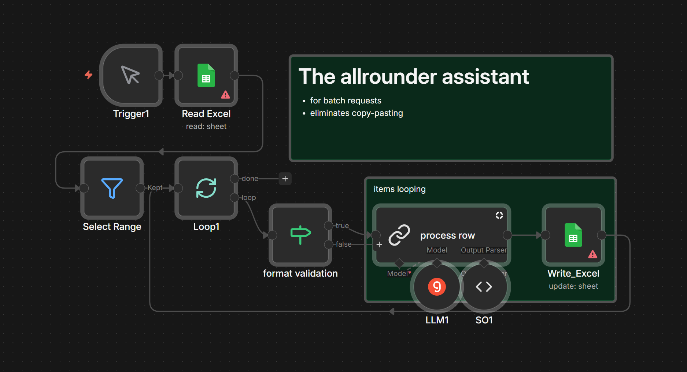

# Bulk Data Processing Workflow

**Video Tutorial:** [Watch](https://www.youtube.com/watch?v=qR_nJLv_Z9g) 

  

Eliminates copy-pasting data rows for analysis one by one. Process hundreds of rows automatically instead of manual repetition.

---

## ⚡ Quick Start
- [setup-guide.md](docs/setup-guide.md)

## 📦 Requirements

- n8n ([cloud](https://n8n.cloud) or [self-hosted](https://youtu.be/kq5bmrjPPAY))
- Data source (Google Sheets, CSV, etc.)
- LLM access (Groq free tier, OpenAI, Claude, etc.)

## What it does

🔄 Batch process rows
📂 Categorize content
🔍 Extract data
🔗 Combine sources

## Who it's for

Anyone doing repetitive data tasks: content managers, analysts, marketers processing large datasets for categorization, extraction, or analysis.

## Workflow Preview

  

## Structured Output

See `.st.json` files for JSON Schema examples.
