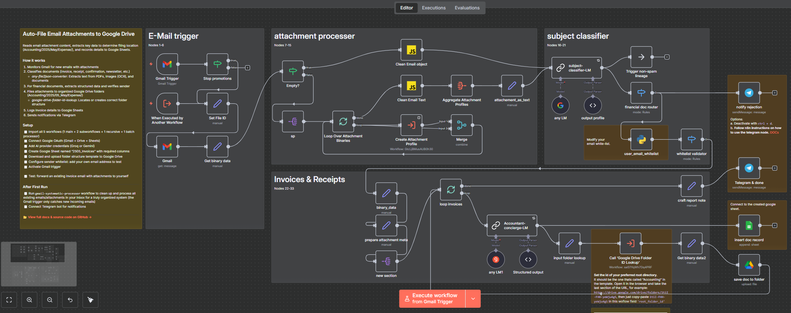

# AI Email Monitoring (I): Auto-File Email Attachments

  

Automatically process email attachments (images, PDFs, documents), understand content through AI, and file to structured Google Drive folders.

**Perfect for:** Organizing receipts, invoices, or any attachment into `Accounting/2025/02_February/Expense/`

---

> ### Single Authentication Advantage
>
> **Authentication is automation's biggest bottleneck.** This workflow operates with **ONE Google OAuth connection** (Gmail + Drive + Sheets) — avoiding the 3-5 platform authentications typical workflows require.

## 🌟 Use Cases

**Out-of-the-box:** Financial documents (invoices, receipts)

## 📋 Features

 ✅ Reads images via AI vision (Gemini Flash OCR) and processes PDFs and documents.

 ✅ Logs to Google Sheets

 ✅ Extensible via structured output schemas

 ✅ Processes existing emails in mailbox (not just new incoming emails)

---

## ⚡ Quick Start
- [setup-guide.md](docs/setup-guide.md)

## 📦 Requirements

- [subworkflows.md](docs/subworkflows.md)
- [credentials-guide.md](config/credentials-guide.md)
    - Gmail, Google Drive, Google Sheets
        - **Two Google Sheets required:** `2505_Invoices` (invoice logging) + `PathToIDLookup` (folder structure cache)
    - LLM: Groq (free) or Gemini (free tier)
    - Optional: Telegram bot