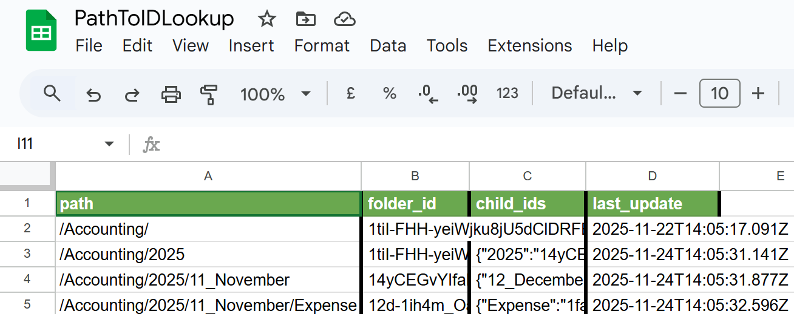

## ⚡ Quick Start

**Time:** 60 minutes | **Difficulty:** Easy | **Cost:** Free

> ### ⚡ Setup Advantage
>
> Although its complexity; this automation has one of the simplest n8n-authentication setups, because it only requres **ONE Google OAuth connection** (Gmail + Drive + Sheets), contrary to most workflows that use 3-5 platforms.
> 
> Moreover, no **Standard n8n cloud nodes only** — no self-hosted requirements.

### 1. Import Workflows
Download and paste these workflow clipboard :clipboard: content directly into your [n8n-browser-window](n8n.io) :
1. [inbox-attachment-organizer.json](../workflows/inbox-attachment-organizer.json) - Main workflow
2. [any-file2json-converter.json](../workflows/subworkflows/any-file2json-converter.json) - Subworkflow: Converts attachments to text
3. [google-drive-folder-id-lookup.json](../workflows/subworkflows/google-drive-folder-id-lookup.json) - Subworkflow: Locates/creates folders
4. [google-drive-folder-id-recursion.json](../workflows/subworkflows/google-drive-folder-id-recursion.json) - Recursive subworkflow (used by folder lookup)
5. [gmail-systematic-processor.json](../workflows/subworkflows/gmail-systematic-processor.json) - Batch processor for existing emails

### 2. Setup Credentials
Only one authentication needed: **Google OAuth**

Follow: [credentials-guide.md](config/credentials-guide.md)

### 3. Create Google Sheet
Create a Google Sheet named **"2505_Invoices"** with these exact column headers:

**Easy setup:** Copy the line below and paste it into row 1 of your Google Sheet. The tabs will automatically create separate columns.

```
invoice_number	supplier_name	invoice_date	total_amount_due	currency_code	subtotal_amount	payment_method	supplier_address	recipient_business_name	payment_reference	date_paid	due_date	invoice_status	purchase_order_number	tax_amount	payment_terms	date_received	supplier_vat_number	supplier_tax_id	discount_amount	approver_id	approver_name	department_id	cost_center_code	supplier_contact_details	supplier_bank_account_details	internal_reference_number	recipient_business_address
```

Place this sheet at the root of your Google Drive accounting folder (e.g., `/Accounting/2505_Invoices`)

### 4. Create PathToIDLookup Google Sheet
Create a Google Sheet named **"PathToIDLookup"** with these exact column headers:

**Easy setup:** Copy the line below and paste it into row 1 of your Google Sheet.

```
path	folder_id	child_ids	last_update
```

**Purpose:** This sheet acts as a cache for Google Drive folder structure lookups, significantly improving performance by avoiding repeated API calls.

**Location:** Place this sheet at the **root directory** of your Google Drive (not inside Accounting or any subfolder)

**How it works:** The `google-drive-folder-id-lookup` and `google-drive-folder-id-recursion` subworkflows automatically populate this sheet as they traverse and create folders. You don't need to manually add any data.

**Example of populated sheet:**



*The sheet caches folder paths and their corresponding Google Drive IDs, enabling fast lookups without repeated API calls.*

### 5. Activate
- Send test email with invoice attachment
- Check Google Drive for auto-created folders
- **For existing emails:** Run the `gmail-systematic-processor` workflow to process all emails already in your mailbox (the Gmail trigger only catches new incoming emails)
- Activate Gmail trigger ✅

**Note:** Google Drive folders will be auto-created in this structure:
```
/Accounting/
  └─ 2025/
      └─ 05_May/
          ├─ Revenue/
          └─ Expense/
```

### 6. Optional: Pre-create Folder Structure

While the workflow auto-creates folders, you can download a ready-made template structure:

**Download:** [templates/drive-folder-structure/](../templates/drive-folder-structure/)

This template includes:
- Root folder: `Accounting` (you can rename this to anything: "Documents", "Invoices", etc.)
- Full year structure (2025) with all 12 months formatted as `01_January`, `02_February`, etc.
- Each month contains `Revenue/` and `Expense/` subdirectories

**To use:** Download the entire folder structure from GitHub and upload it to your Google Drive. You can rename "Accounting" to match your needs - just update the path in your workflow configuration accordingly.

## 🌟 Use Cases

**Out-of-the-box:** Financial documents (invoices, receipts)

**Extend to:**
- Legal contracts (Contracts/ClientName/YYYY/)
- HR documents (Personnel/EmployeeName/)
- Project files (Projects/ProjectName/Deliverables/)