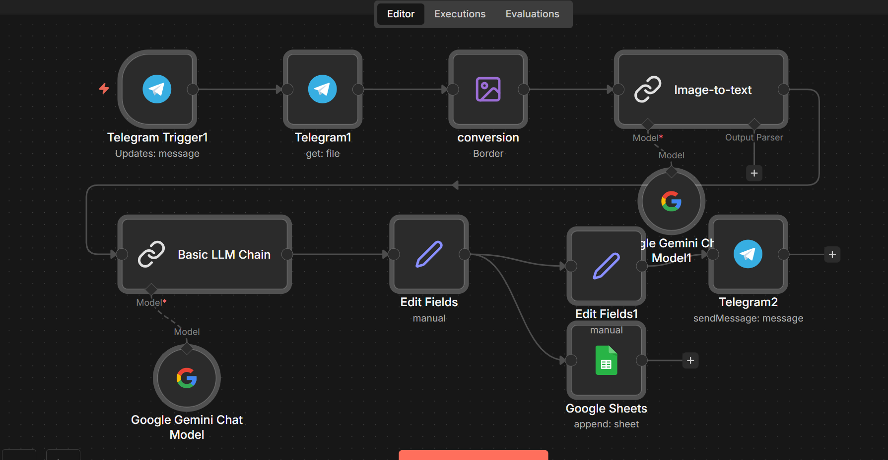
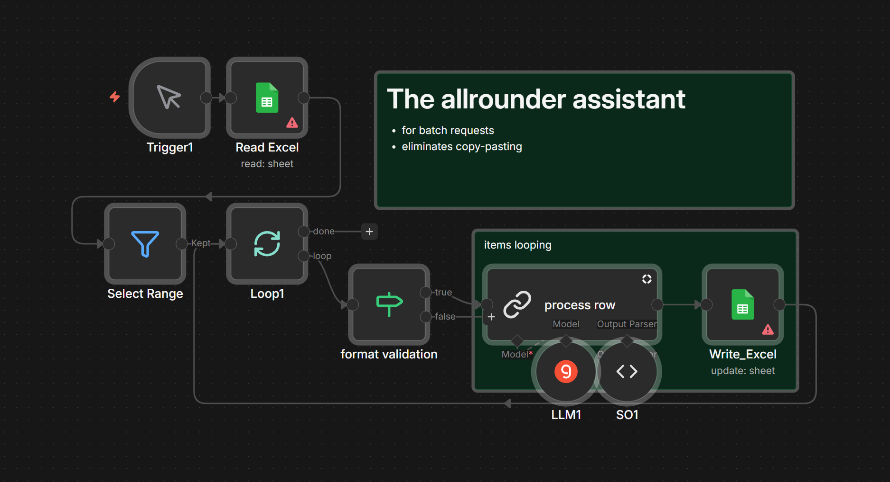
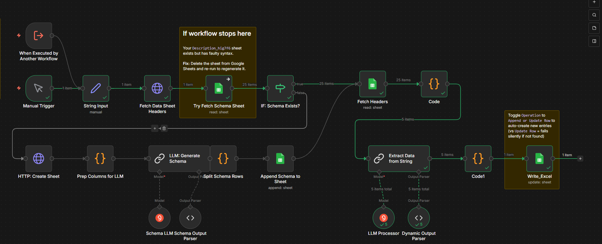
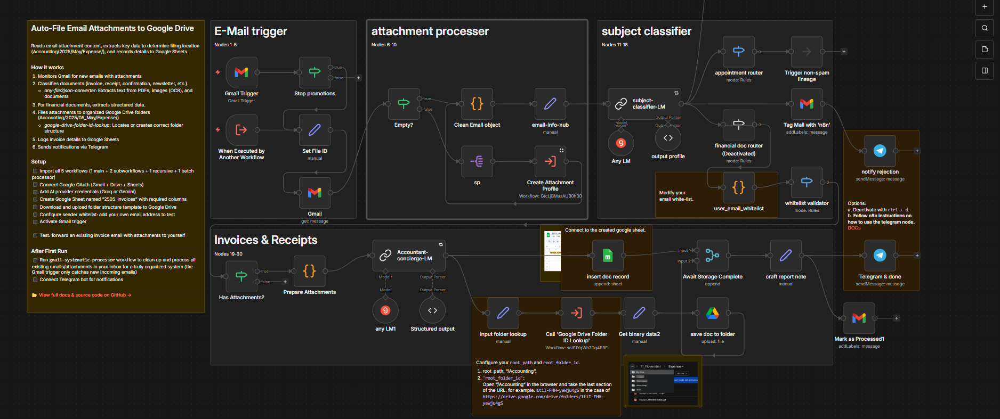

# n8n

Automation workflows for document processing and AI-powered data extraction.

Batch LLM processing, email attachment organization, invoice OCR, structured output from unstructured text. Runs on Groq and Gemini free tiers.

---

## 🌟 Featured Projects

### [04_inbox-attachment-organizer](04_inbox-attachment-organizer)

Automatically process email attachments, understand content through AI, and file to structured Google Drive folders.

**Jump to:** [Use Cases](04_inbox-attachment-organizer#-use-cases) · [Quick Start](04_inbox-attachment-organizer/docs/setup-guide.md)

### [02_smart-table-fill](02_smart-table-fill)

Extract structured data from unstructured text into any Google Sheets table — zero schema configuration required.

**Jump to:** [Use Cases](02_smart-table-fill#-use-cases) · [Quick Start](02_smart-table-fill/docs/setup-guide.md)

---

## 📋 Full List

| | Project | Description |
|:---:|---------|-------------|
|  | [00_telegram-invoice-ocr](00_telegram-invoice-ocr-to-excel) | Photo → Telegram bot → Google Sheets |
|  | [01_LLM-bulk-responses](01_LLM-bulk-responses) | Batch process spreadsheet rows with AI |
|  | [02_smart-table-fill](02_smart-table-fill) | Text in, structured data out |
|  | [04_inbox-attachment-organizer](04_inbox-attachment-organizer) | Email attachments → AI → Google Drive |

---

## 📚 Resources

- [credentials-guide.md](credentials-guide.md) — Setting up API credentials
- [troubleshooting.md](troubleshooting.md) — Common issues and fixes
- [docs/workflow-as-code-sdk.md](docs/workflow-as-code-sdk.md) — Optional: edit these workflows as typed TypeScript

> **Prefer code over the visual editor?** These workflows are plain JSON, so you can integrate the official [`@n8n/workflow-sdk`](https://www.npmjs.com/package/@n8n/workflow-sdk) to turn any workflow into typed TypeScript, refactor it with full autocomplete and type-checking, and build it back to JSON. It's an optional add-on — the n8n UI remains the primary way to edit. Setup and commands: [docs/workflow-as-code-sdk.md](docs/workflow-as-code-sdk.md).

> **Privacy:** LLM providers often have lenient data policies to improve their services. If you're concerned about privacy, review provider policies first. You can configure privacy settings at the provider level when creating your API key. See [PRIVACY.md](PRIVACY.md).
