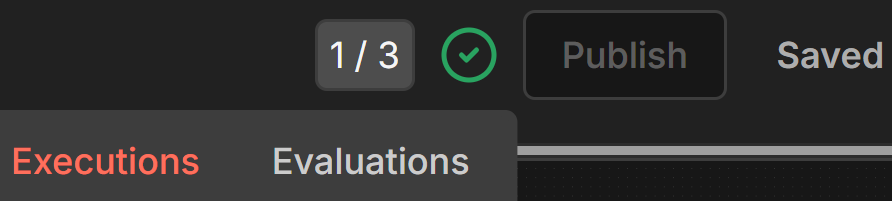

# n8n Troubleshooting

## Subworkflows Not Reflecting Changes

Execution behaves differently than when you tested? You tested the subworkflow directly, not via the parent - and forgot to republish.

**Fix**: Republish the subworkflow.

If publish button won't work (an error like *1 node has issues, fix them before publishing.*):

1. Go to Executions
2. Pick a successful run → Copy to Editor
3. Publish

This works because the execution data fills in whatever n8n thinks is missing.

---

## LLM Structured Output Errors

Error: "Model output doesn't fit required format" or empty error `{}` in error handler.

**Cause**: The LLM failed to return valid JSON matching the required schema. Smaller or older models struggle with structured output.

**Fix**: Use a model with better structured output support:
- **OpenAI gpt-oss-120b** - Best open-source model for structured output (as of Jan 2026)
- Simplify the schema if possible (fewer required fields, simpler nesting)

---

## Apps Script Execution API

### 404 "Requested resource/entity was not found"

- **Most common:** You're using Script ID instead of Deployment ID
- **Fix:** Get the Deployment ID from Deploy > Manage deployments (starts with `AKfycb...`)

### Permission Errors

- Re-run `testWriteContactData` in Apps Script editor
- Complete the authorization flow again
- Verify all 3 scopes in `appsscript.json`

### GCP Project Mismatch

- Apps Script must be linked to the **same** GCP project as your OAuth credentials
- Verify Project Number (not ID) matches in both places

### Dataset Size Limitation

The Apps Script loads the entire sheet into memory to find rows:
- Works well for sheets < 5,000 rows
- May timeout or fail on very large sheets (10,000+ rows)
- Apps Script has 6-minute execution limit and ~6MB heap
